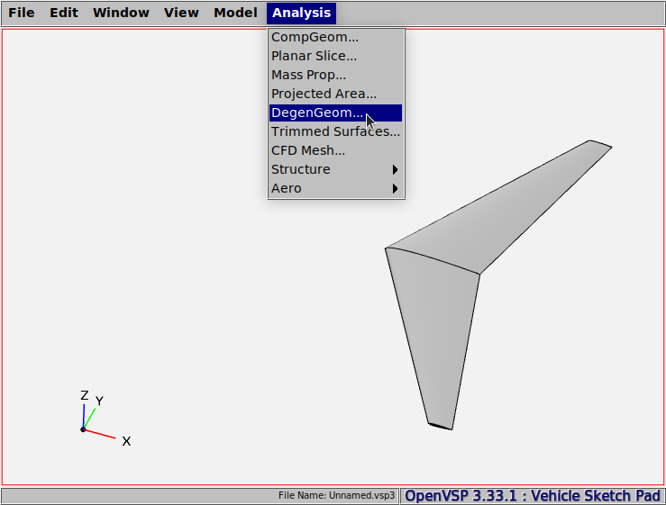
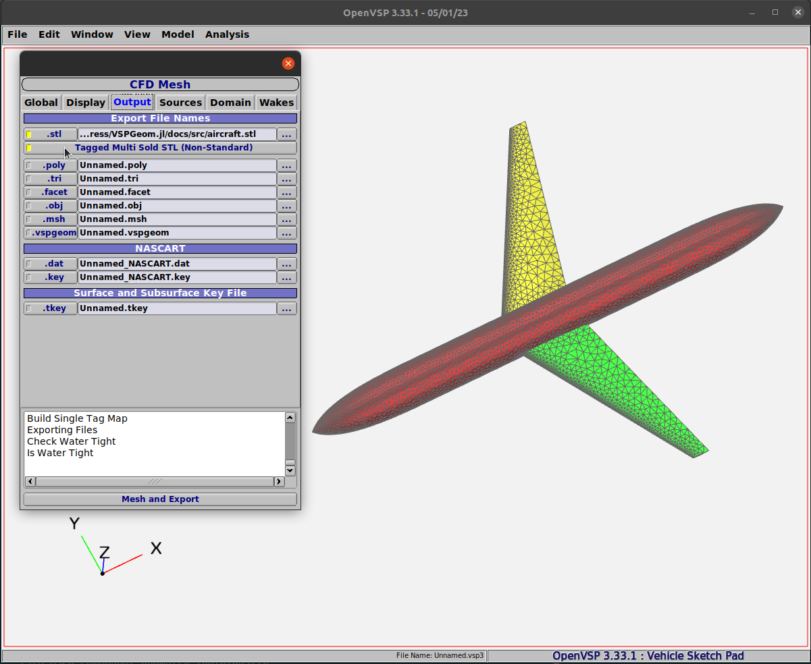
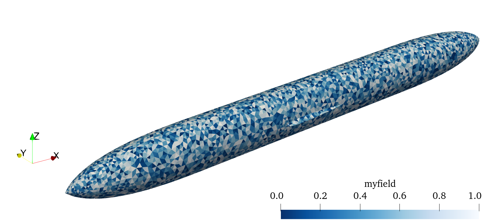

# Guided Examples

This section describes examples of how to use VSPGeom to import different types of geometry. It assumes familiarity with basic usage.

## DegenGeom Files
### OpenVSP geometry 
We start by creating a geometry in OpenVSP. Let's use the default wing geometry and write out a CSV DegenGeom file using the tab *Analysis* > *DegenGeom*.


### Import to Julia
We shall now use VSPGeom to import the DegenGeom file into Julia. We make use of the `readDegenGeom` function to read the file. We would also like to know the output that we obtained from `readDegenGeom`.
```@example 1
using VSPGeom

comp = readDegenGeom("wing.csv")

println(typeof(comp))
println(size(comp))
```

The various geometry components in the DegenGeom file will now be available to us in the variable `comp` which appears to be a Vector of [`VSPComponent`](@ref) objects. This specific vector has two elements in it. Before we start using this object, let's inspect it using the `dump` function provided by Julia.
```@repl 1
dump(VSPComponent)
```
Besides several variables like `type`, `name`, `GeomID` etc. that describe the geometry, we notice a collection of `DataFrame` objects. These are the degenGeom representations of the geometry in the form of `DataFrame` objects. Let's inspect the `PLATE` type of representation for the first component using the `describe` function provided by the `DataFrames` package.
```@repl 1
VSPGeom.DataFrames.describe(comp[1].plate)
```

The `PLATE` degenGeom representation for component 1 has the variables `x`, `y`, `z`, `zCamber` and so on inside it. These correspond to the right half of the OpenVSP Wing geometry. Component 2 represents the left half of the wing that lies in the negative Y-plane indicated by the negative values for `y` in its dataframe or table. We can also display a summary of only the `y` values for each of the components using the `cols` option.
```@repl 1
println(VSPGeom.DataFrames.describe(comp[1].plate, cols="y"))
println(VSPGeom.DataFrames.describe(comp[2].plate, cols="y"))
```

### DegenGeom variables: Accessing and restructuring as mesh
Variables in the DegenGeom may now be accessed like fields in a struct as shown below. Let's create  a surface plot of the camber surface for the left and right halves of the wing geometry. We shall use the function `degenGeomSize` to obtain the mesh size and restructure the coordinate variables into a surface mesh.
```@example 1
x1 = comp[1].plate.x + comp[1].plate.zCamber .* comp[1].plate.nCamberx;
y1 = comp[1].plate.y + comp[1].plate.zCamber .* comp[1].plate.nCambery;
z1 = comp[1].plate.z + comp[1].plate.zCamber .* comp[1].plate.nCamberz;

x2 = comp[2].plate.x + comp[2].plate.zCamber .* comp[2].plate.nCamberx;
y2 = comp[2].plate.y + comp[2].plate.zCamber .* comp[2].plate.nCambery;
z2 = comp[2].plate.z + comp[2].plate.zCamber .* comp[2].plate.nCamberz;

# Reshape right wing to a mesh
nx, ny = degenGeomSize(comp[1].plate)
xr = reshape(x1, (nx, ny))
yr = reshape(y1, (nx, ny))
zr = reshape(z1, (nx, ny))

# Reshape left wing to a mesh
nx, ny = degenGeomSize(comp[2].plate)
xl = reshape(x2, (nx, ny))
yl = reshape(y2, (nx, ny))
zl = reshape(z2, (nx, ny))

using Plots
surface(xl, yl, zl, zlims=(-4, 4),
        color=:blue, label="Left wing", colorbar=false)
surface!(xr, yr, zr,
        color=:red, label="Right wing", colorbar=false,
        camera=(20, 30), aspect_ratio=1, proj_type=:persp)
```

## STL Files
### OpenVSP geometry 
In addition to the DegenGeom file format, OpenVSP has the capability to generate unstructured triangular element meshes of geometry and write out ASCII STL mesh files. These files may contain a single solid or multiple named solids. Opting for the "Tagged Multi Solid File (non standard)" option during mesh export enables the ability to manipulate each component geometry individually.


### Import to Julia
We shall use the [`readSTL`](@ref) function in VSPGeom to import the geometry from the STL file.
```@example 2
using VSPGeom

geom = readSTL("aircraft.stl")

println(typeof(geom))
println(size(geom))
```
Similar to the `readDegenGeom` function, `readSTL` also returns an array of [`TriMesh`](@ref) geometry objects.

### Accessing STL mesh variables
The vertices of each cell are stored using the connectivity information in the [`TriMesh`](@ref) object. A *unique* list of vertices are populated in `TriMesh.points`. `TriMesh.cells` stores the vertices of each cell using indices. Each index refers to the corresponding point in `TriMesh.points`. The indices start from `0` as prescribed in the STL standard.
The vertices and normals of cells in the [`TriMesh`](@ref) object may be accessed as shown below.
```@example 2
ncells = geom[1].ncells
println("No. of cells = $ncells")

# An arbitrary cell
n = 5

println("Normal of cell $n:")
println(geom[1].normals[n])

vtxs = getVertices(geom[1], n)
println("3 vertices of cell $n:")
println(vtxs[1])
println(vtxs[2])
println(vtxs[3])
```

### STL Connectivity information
When an STL file is read, `VSPGeom` also populates the connectivity information for each of the cells. This information is stored in `TriMesh.cells` as integer indices. For example, the vertex indices for, say the 14th cell, can be displayed as shown below.
```@example 2
geom[1].cells[14]
```
By default, the indices start from 1, which is conventional for arrays in Julia. However, this may be switched to zero-based numbering using the `setZeroBased!` function as shown below. This provision is useful if the connectivity indices require to be written to a format that uses zero-numbering like the VTK format.
```@example 2
setZeroBased!(geom[1]; value=true)
geom[1].cells[14]
```
The [`getVertices`](@ref) function will return the right vertices no matter which convention is used for the index numbering.

### Writing out a VTK geometry file
VSPGeom provides the convenience function [`getVTKElements`](@ref) that enables easy writing out of VTK files using the [`WriteVTK.jl`](https://github.com/JuliaVTK/WriteVTK.jl) package. An example using this function is provided below.
```@example 2
points, cells = getVTKElements(geom[1])

VSPGeom.WriteVTK.vtk_grid("fuselage", points, cells) do vtk
  # This creates a sample scalar field dataset with random numbers
  vtk["myfield"] = rand(geom[1].ncells)
end
```
A screenshot of this VTK file visualized in Paraview is shown below.

