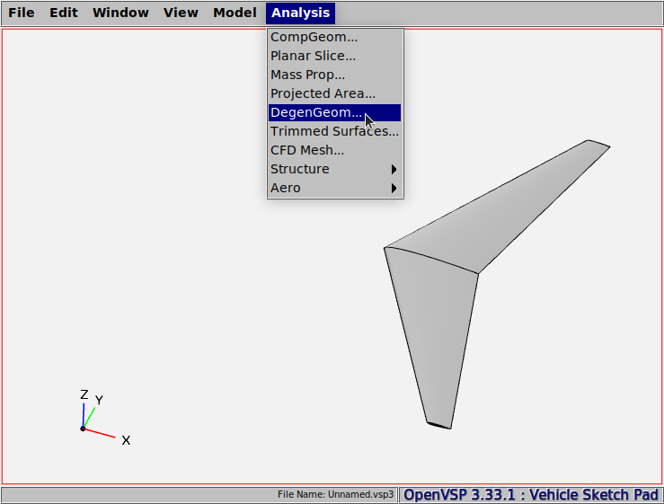

# Guided Examples

This section describes examples of how to use VSPGeom to import different types of geometry. It assumes familiarity with basic usage.

## Tutorial 1
### OpenVSP geometry 
We start by creating a geometry in OpenVSP. Let's use the default wing geometry and write out a CSV DegenGeom file using the tab *Analysis* > *DegenGeom*.


### Import to Julia
We shall now use VSPGeom to import the DegenGeom file into Julia. We make use of the `readDegenGeom` function to read the file. We would also like to know the output that we obtained from `readDegenGeom`.
```@example
using VSPGeom

comp = readDegenGeom("wing.csv")

println(typeof(comp))
println(size(comp))
```

The various geometry components in the DegenGeom file will now be available to us in the variable `comp` which appears to be a Vector of [`VSPComponent`](@ref) objects. This specific vector has two elements in it. Before we start using this object, let's inspect it using the `dump` function provided by Julia.
```@repl
using VSPGeom

dump(VSPComponent)
```
Besides several variables like `type`, `name`, `GeomID` etc. that describe the geometry, we notice a collection of `DataFrame` objects. These are the degenGeom representations of the geometry in the form of `DataFrame` objects. Let's inspect the `PLATE` type of representation for the first component using the `describe` function provided by the `DataFrames` package.
```@example
using VSPGeom, DataFrames

comp = readDegenGeom("wing.csv")

describe(comp[1].plate)
```

The `PLATE` degenGeom representation for component 1 has the variables `x`, `y`, `z`, `zCamber` and so on inside it. These correspond to the right half of the OpenVSP Wing geometry. Component 2 represents the left half of the wing that lies in the negative Y-plane indicated by the negative values for `y` in its dataframe or table. We can also display a summary of only the `y` values for each of the components using the `cols` option.
```@example
using VSPGeom, DataFrames

comp = readDegenGeom("wing.csv")

println(describe(comp[1].plate, cols="y"))
println(describe(comp[2].plate, cols="y"))
```

### Accessing DegenGeom variables
Variables in the DegenGeom may now be accessed like fields in a struct as shown below. Let's create  a surface plot of the camber surface for the left and right halves of the wing geometry. We shall use the function `degenGeomSize` to obtain the mesh size and restructure the coordinate variables into a surface mesh.
```@example
using VSPGeom

comp = readDegenGeom("wing.csv")

x1 = comp[1].plate.x + comp[1].plate.zCamber .* comp[1].plate.nCamberx;
y1 = comp[1].plate.y + comp[1].plate.zCamber .* comp[1].plate.nCambery;
z1 = comp[1].plate.z + comp[1].plate.zCamber .* comp[1].plate.nCamberz;

x2 = comp[2].plate.x + comp[2].plate.zCamber .* comp[2].plate.nCamberx;
y2 = comp[2].plate.y + comp[2].plate.zCamber .* comp[2].plate.nCambery;
z2 = comp[2].plate.z + comp[2].plate.zCamber .* comp[2].plate.nCamberz;

# Reshape right wing to a mesh
nx, ny = degenGeomSize(comp[1].plate)
xr = reshape(x1, (nx, ny))
yr = reshape(y1, (nx, ny))
zr = reshape(z1, (nx, ny))

# Reshape left wing to a mesh
nx, ny = degenGeomSize(comp[2].plate)
xl = reshape(x2, (nx, ny))
yl = reshape(y2, (nx, ny))
zl = reshape(z2, (nx, ny))

using Plots
surface(xl, yl, zl, 
        zlims=(-4, 4), color=:blue, ma=0.5, label="Left wing", colorbar=false)
surface!(xr, yr, zr,
        zlims=(-4, 4), color=:red, ma=0.5, label="Right wing", colorbar=false)
```
