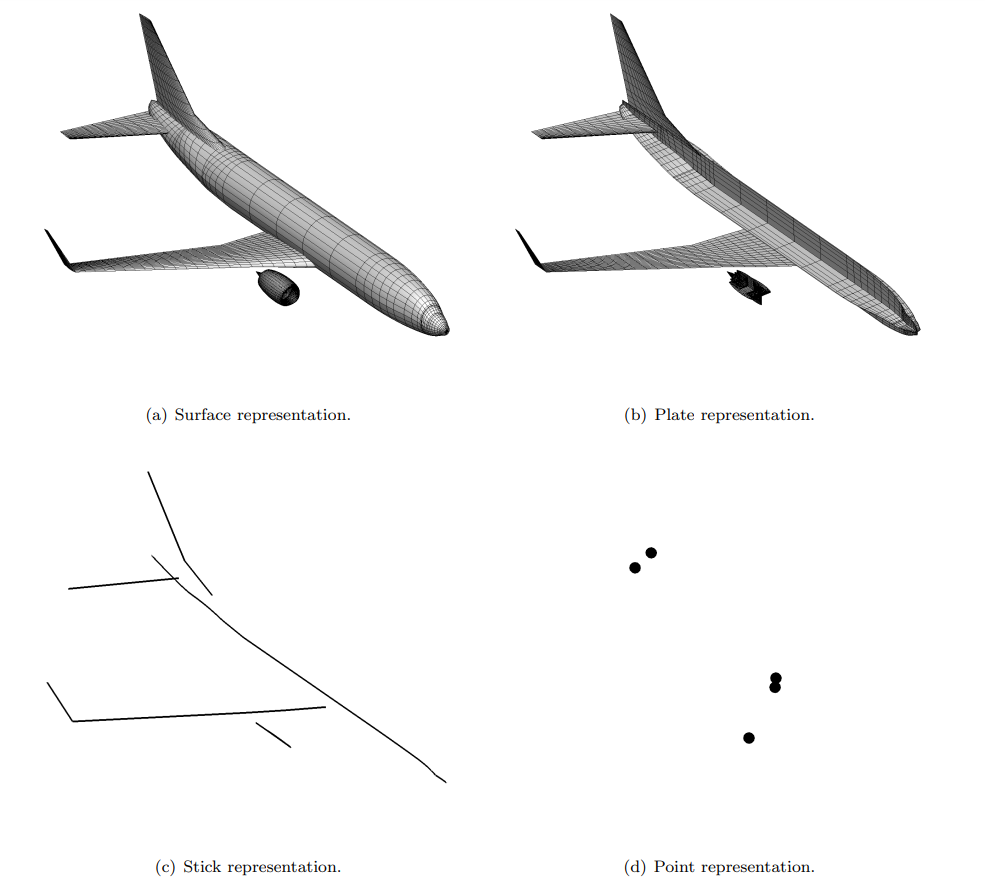

# Quick Start

This starter tutorial provides a quick overview of important VSPGeom functions that help importing geometry into Julia. A detailed walkthrough of features is available in [Guided Examples](@ref).

## DegenGeom
OpenVSP has provisions to create multi-fidelity representations of geometry called Degenerate geometry or *DegenGeom*. This is done by creating a OpenVSP geometry and clicking *Analysis* > *DegenGeom* to write out a DegenGeom file. A DegenGeom file is a collection of comma-separated tables, each representing a multi-fidelity representation of the geometry. There are primarily four types of degenerate geometry:
1. Surface
2. Plate
3. Stick
4. Point
Plate representations are typically used for aerodynamic solvers like a Vortex lattice solver; while stick representations are common in beam element-based structural solvers.

Image from McDonald, R. A., & Gloudemans, J. R. (2022). Open Vehicle Sketch Pad: An Open Source Parametric Geometry and Analysis Tool for Conceptual Aircraft Design. In AIAA SCITECH 2022 Forum.

## Tutorial
Use the `readDegenGeom` function to import geometry into a [`VSPComponent`](@ref) object from the DegenGeom CSV file. Variables, like coordinates `x, y, z`, of each degenGeom are available as fields inside the VSPComponent.
```@julia
using VSPGeom

comp = readDegenGeom("wing.csv")
x = comp[1].plate.x
y = comp[1].plate.y
z = comp[1].plate.z
```

The function `degenGeomSize` can be used to obtain the mesh size and restructure the coordinate variables into a surface mesh.
```@julia
using VSPGeom

comp = readDegenGeom("wing.csv")

x = comp[1].plate.x
y = comp[1].plate.y
z = comp[1].plate.z

# Reshape wing to a mesh
nx, ny = degenGeomSize(comp[1].plate)
xg = reshape(x, (nx, ny))
yg = reshape(y, (nx, ny))
zg = reshape(z, (nx, ny))
```
